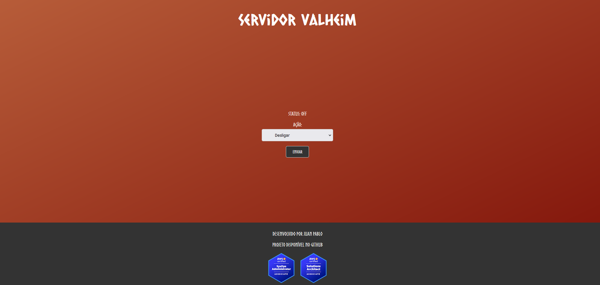
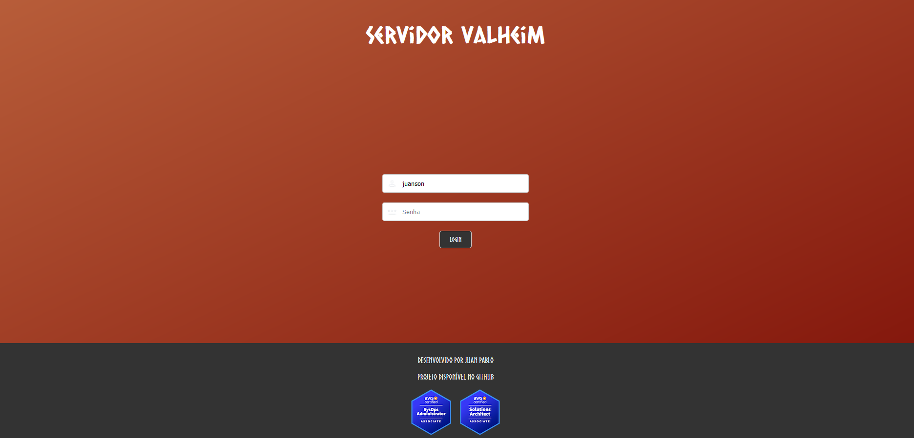
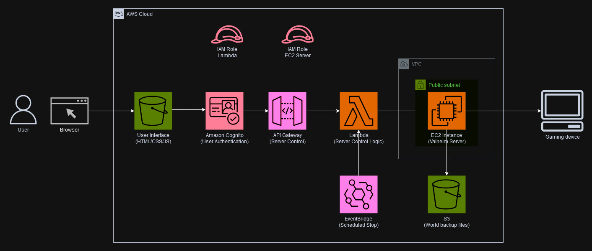

# Valheim Personal Server

This project sets up a personal Valheim server using Terraform, AWS, and Docker.





## Project Structure

- `frontend/`: Contains the HTML, CSS, and fonts for the server control interface.
- `terraform/`: Contains Terraform configuration files for setting up the AWS infrastructure.
- `terraform/scripts/`: Contains scripts for server setup and management.

## Diagram



## Prerequisites

- Terraform
- AWS CLI
- Docker

## Setup

1. **Clone the repository**:
    ```sh
    git clone https://github.com/yourusername/valheim-personal-server.git
    cd valheim-personal-server
    ```

2. **Configure AWS CLI**:
    ```sh
    aws configure
    ```

3. **Initialize Terraform**:
    ```sh
    cd terraform
    terraform init
    ```

4. **Apply Terraform configuration**:
    ```sh
    terraform apply
    ```

5. **Access the server control interface**:
    Open [control_server.html](http://_vscodecontentref_/1) in your browser.

## Usage

- **Start/Stop Server**: Use the control interface to start or stop the Valheim server.
- **Monitor Server**: Check the server status and access details through the control interface.
